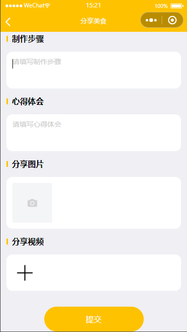

# 基于Java+Springboot+Vue菜谱小程序-毕业设计

# 获取地址

#### 作者QQ：3275035005 微信：xkbishe123 (支持修改、 部署调试、 代做接毕业设计和课程设计)

#### 网站建设、小程序、H5、APP、各种系统、样式修改、10000套源码可选。

#### 选题+开题报告+任务书+程序定制+安装调试+论文+答辩ppt 都可以做

#### 问题包修改，包满意，有需求尽管甩过来！一条龙帮你安心过！

#### 所有项目以及源代码本人均调试运行无问题 可支持远程调试运行

# 项目介绍
基于Java+Springboot+Vue菜谱小程序，本系统采用前后端分离开发，分为用户端、管理端、商家端，项目采用前后端分离

可选题目：社区菜谱小程序、菜谱小程序

### 1. 用户

用户登录，用户注册、查看食材、加入购物车、食材下单、查看菜谱、收藏菜谱、加入购物车菜谱食材、查看历史订单、地址管理、我的收藏、个人信息修改、查看美食社区、分享美食 

###  2. 管理员

登录、查看社区分享、社区分享审核、用户管理

###  3. 商家端

登录、工作台统计、数据可视化统计、订单管理、菜谱管理、食材管理、分类管理 

# 技术框架
- 开发语言：Java 
- 数据库：Mysql 
- 系统环境：jdk8、maven、node
- 后端框架：SpringBoot、MyBatisplus、MyBatis
- 前端框架：Vue、Elementui、微信小程序
- 小程序：Uniapp
- 工具：IDEA、Navicat、微信开发者工具、HBuilder
- 技术架构：前后端分离、B/S架构、MVC架构
# 项目截图

### 1. 微信端

### 2. 商家端

### 2. 管理端

